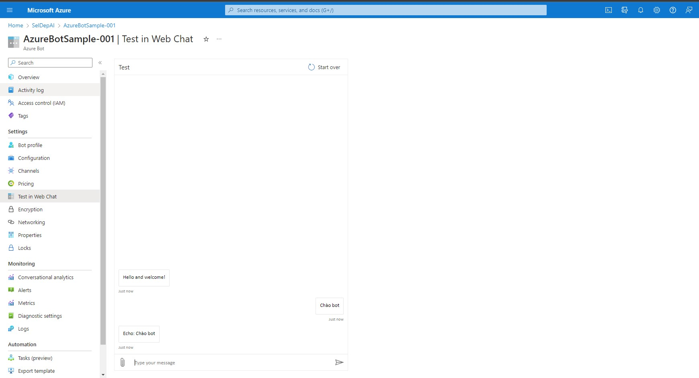
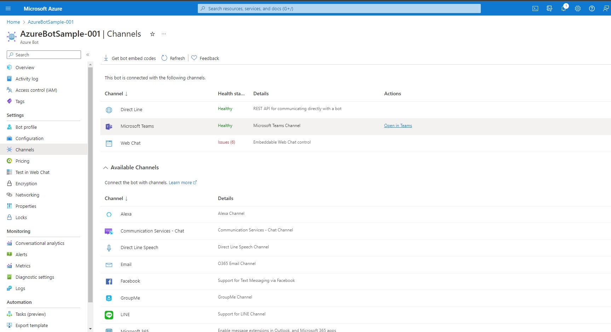
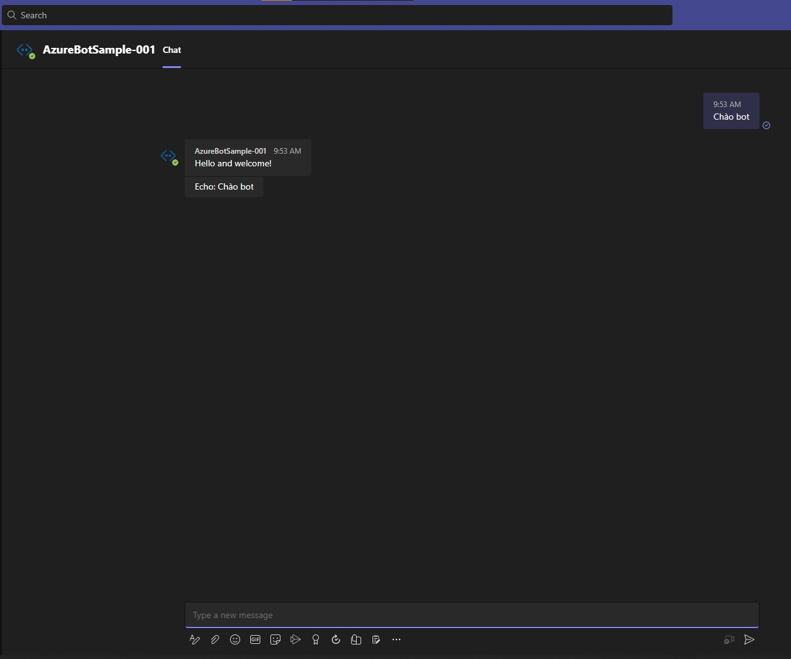

# Use the Azure portal and Azure CLI to Create an Azure Bot Python resource 

### Step 1: Create Resource Group
<p align="center">
  
</p>

### Step 2: Create App Registrations
<p align="center">
  
</p>

### Step 3: Create App Service
```
az deployment group create --resource-group <Name-of-Resource-Group> --template-file template-BotAppService.json --parameters parameters-template-BotAppService.json
```
Exlample 
```
az deployment group create --resource-group "MyGroupResource" --template-file template-BotAppService.json --parameters parameters-template-BotAppService.json
```
### Step 4: Create Azure Bot
```
az deployment group create --resource-group <Name-of-Resource-Group> --template-file template-AzureBot.json --parameters parameters-template-AzureBot.json
```
Exlample 
```
az deployment group create --resource-group "MyGroupResource" --template-file template-AzureBot.json --parameters parameters-template-AzureBot.json
```
### Step 5: Deploy App to Azure App Service
```
az webapp deployment source config-zip --resource-group <Name-of-Resource-Group> --name <Name-of-BotApp-service> --src bot-service.zip
```
Exlample 
```
az webapp deployment source config-zip --resource-group "MyGroupResource" --name "BotAppServiceSample-001" --src bot-app-service-sample.zip
```

## Result Build Bot
### Test Chat Azure
<p align="center">
  
</p>

### Test Chat in Microsoft Teams
<p align="center">
  
</p>
<p align="center">
  
</p>

## Reference 
- https://learn.microsoft.com/en-us/azure/bot-service/bot-service-quickstart-create-bot?view=azure-bot-service-4.0&tabs=python%2Cvs
